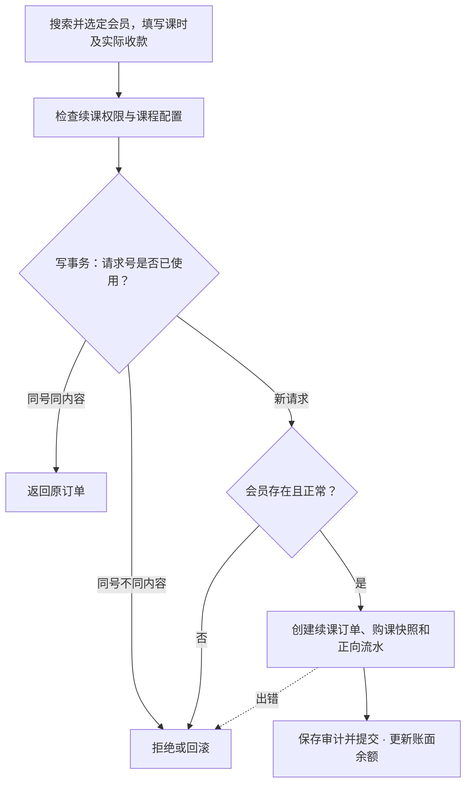

# 老会员续课

续课复用现有会员档案，保留已有账号和密码。停用及归档会员的状态不会因续课改变。课时和收款金额均独立校验，重复请求不重复入账。

```mermaid
flowchart TD
    A["搜索并选定会员，填写课时及实际收款"] --> B["检查续课权限与课程配置"]
    B --> C{"写事务：请求号是否已使用？"}
    C -->|同号同内容| D["返回原订单"]
    C -->|同号不同内容| X["拒绝或回滚"]
    C -->|新请求| E{"会员存在且正常？"}
    E -->|否| X
    E -->|是| F["创建续课订单、购课快照和正向流水"]
    F --> G["保存审计并提交 · 更新账面余额"]
    F -.->|出错| X
```

[快捷页面](../../../studio/quick_views.py) · [购课服务](../../../studio/services.py) · [测试](../../../studio/tests/test_quick.py)
