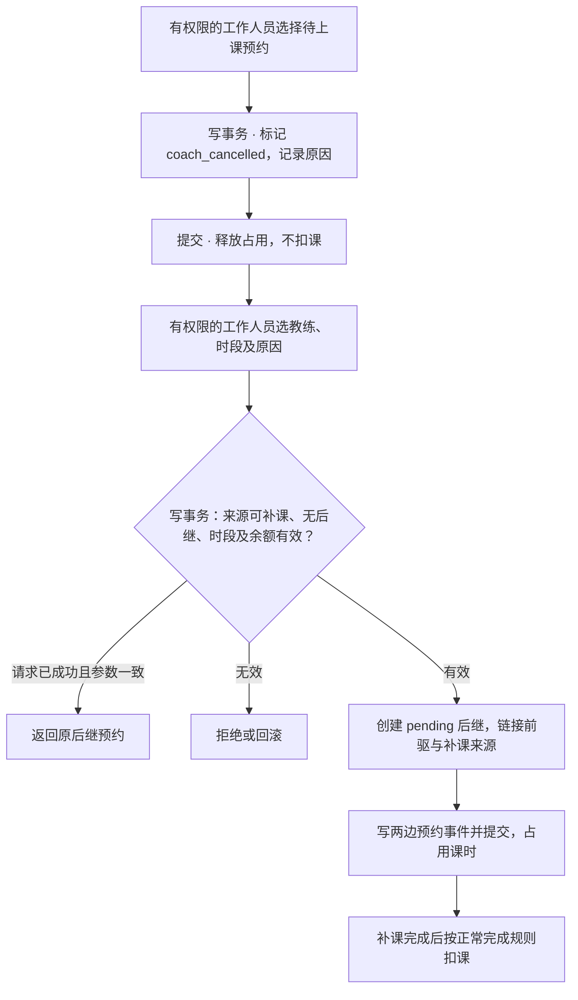

# 教练取消与补课

此前正常取消的补课仍可成为后续补课的来源。后继预约保留课时成本快照，原始预约保留历史，补课不重复为原教练取消扣课。

```mermaid
flowchart TD
    A["有权限的工作人员选择待上课预约"] --> B["写事务 · 标记 coach_cancelled，记录原因"]
    B --> C["提交 · 释放占用，不扣课"]
    C --> D["有权限的工作人员选教练、时段及原因"]
    D --> E{"写事务：来源可补课、无后继、时段及余额有效？"}
    E -->|请求已成功且参数一致| R["返回原后继预约"]
    E -->|无效| X["拒绝或回滚"]
    E -->|有效| F["创建 pending 后继，链接前驱与补课来源"]
    F --> G["写两边预约事件并提交，占用课时"]
    G --> H["补课完成后按正常完成规则扣课"]
```

[课务服务](../../../studio/services.py) · [补课与课时规则测试](../../../studio/tests/test_m4_rules.py)
